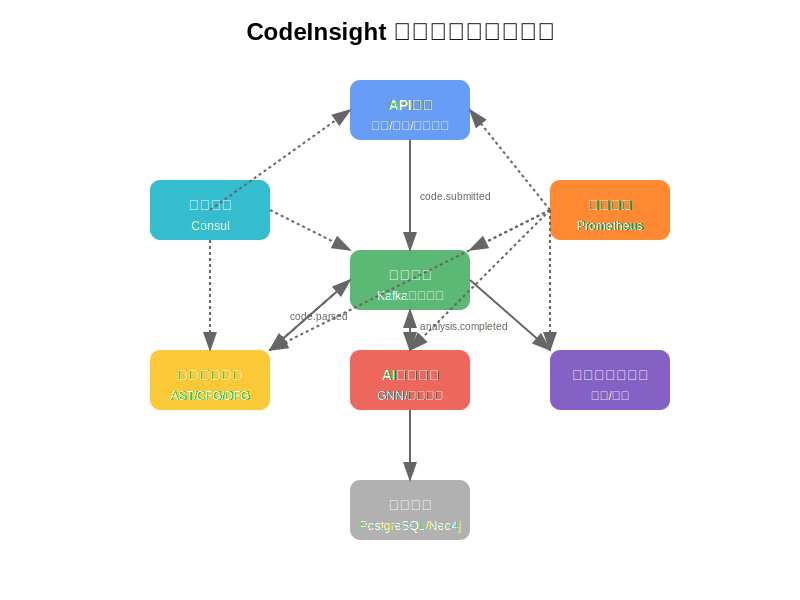

## Intelligent Code Review and Architecture Analysis Platform

This repository hosts the monorepo for the Intelligent Code Review and Architecture Analysis Platform. The platform delivers a full-stack workflow for AI-assisted code review, architectural health monitoring, GitHub automation, baseline management, and compliance reporting.

The entire codebase, documentation, and user interface are provided in English to simplify global collaboration and auditing.

## Capabilities

- **Code Analysis Workbench** – hybrid static and dynamic analysis pipelines with AI-driven review suggestions, inline remediation, and actionable quality metrics.
- **GitHub Connect** – OAuth-based authentication, repository synchronization, and actionable insights for every pull request or branch.
- **Project Operations Hub** – CRUD dashboards for projects, releases, milestones, and ownership, including relationships to sessions, baselines, and defects.
- **Session Management** – granular tracking for each analysis or test execution, artifact lineage, and intelligent auto-restart workflows.
- **Version Intelligence** – diff visualizations, semantic versioning guardrails, and changelog generation backed by diff2html.
- **Search & Discovery** – federated search with facet filters, AI summaries, and saved views for instant investigations.
- **Baseline Governance** – configurable KPI baselines, deviation detection, risk scoring, and mitigation templates.
- **Settings & Compliance** – tenant-aware configuration, feature toggles, provider credentials, and audit logging.
- **Help & Achievements** – embedded help center, self-serve runbooks, and gamified achievements that reinforce best practices.
- **AI Collaboration** – right-rail chat workspace supporting multiple LLM providers with routing, templating, and conversation storage.

## Architecture Overview



The platform follows an event-driven microservice architecture:

1. API Gateway authenticates requests and emits intent events.
2. Code parsing services generate AST, CFG, and dataflow graphs.
3. AI analysis services run graph reasoning for quality, security, and architectural drift.
4. Persistence services capture snapshots for baselines, diffs, and audit logs.
5. Realtime channels and webhooks push verdicts back to users and partner systems.

## Tech Stack

- **Frontend**: React 18, TypeScript, Ant Design 5, React Router 6, CodeMirror 6, Diff2Html.
- **Backend**: Python 3.11, FastAPI, SQLAlchemy, PostgreSQL, Redis, Neo4j, Celery.
- **AI Layer**: PyTorch, Transformers, DGL, custom ensemble runners.
- **Orchestration**: Docker, Docker Compose, Terraform modules for AWS.
- **Monitoring**: Prometheus, Logstash, custom system monitor scripts.

## Getting Started

### Prerequisites

Ensure you have the following installed:

- **Docker** 20.10+ and Docker Compose 2.0+
- **Node.js** 18+ and npm 8+
- **Python** 3.11+ (for local development)
- **Git** for version control

### Quick Start (Recommended)

The platform includes a cross-platform one-command runner that builds and starts everything with health checks.

```bash
# Clone the repository
git clone <repository-url>
cd AI-Code-Review-and-Architecture-Analysis-Platform

# One-command build and start (cross-platform)
npm run build
```

This single command will:

- 🏗️ Build all Docker images with multi-stage optimization
- 🚀 Start all services with health checks and monitoring
- 📊 Verify service availability and dependencies
- 🎉 Display success banner with access URLs
- 📈 Set up monitoring dashboards

#### Available Commands

```bash
npm run build      # Build and start all services
npm run start       # Start services (if already built)
npm run down        # Stop and remove all services
npm run logs        # Show service logs
npm run health      # Check service health
npm run doctor      # System diagnostics
npm run clean       # Clean up Docker resources
npm run dev         # Development mode with hot reload
npm run prod        # Production mode with optimizations
```

#### Environment Configuration

Create a `.env` file for custom configuration:

```bash
# Database Configuration
POSTGRES_DB=codeinsight
POSTGRES_USER=postgres
POSTGRES_PASSWORD=your_secure_password

# Application Configuration
NODE_ENV=development
REACT_APP_API_URL=http://localhost:8000
REACT_APP_WS_URL=ws://localhost:8000

# AI/ML Configuration
OPENAI_API_KEY=your_openai_key
ANTHROPIC_API_KEY=your_anthropic_key

# Monitoring
PROMETHEUS_ENABLED=true
GRAFANA_ADMIN_PASSWORD=admin123
```

### Enhanced Docker Setup

For production or enhanced development, use the optimized Docker configuration:

```bash
# Use enhanced configuration with monitoring
docker-compose -f docker-compose.enhanced.yml up --build -d

# View service status
docker-compose -f docker-compose.enhanced.yml ps

# View logs
docker-compose -f docker-compose.enhanced.yml logs -f
```

### Local Development Setup

#### Backend Development

```bash
# Navigate to backend directory
cd backend

# Create virtual environment
python -m venv .venv

# Activate virtual environment
# On Windows:
.venv\Scripts\activate
# On macOS/Linux:
source .venv/bin/activate

# Install dependencies
pip install -r requirements.txt

# Run database migrations
alembic upgrade head

# Start development server
uvicorn app.main:app --reload --host 0.0.0.0 --port 8000
```

#### Frontend Development

```bash
# Navigate to frontend directory
cd frontend

# Install dependencies
npm install

# Start development server
npm start

# For production build
npm run build

# Run tests
npm test
```

### Service Endpoints

After starting the services, you can access:

#### Application Endpoints

- **Frontend Application**: http://localhost:3000
- **Backend API**: http://localhost:8000
- **API Documentation**: http://localhost:8000/docs
- **WebSocket Endpoint**: ws://localhost:8000/ws

#### Database Endpoints

- **PostgreSQL**: localhost:5432
- **Redis**: localhost:6379
- **Neo4j Browser**: http://localhost:7474 (neo4j/password)

#### Monitoring Endpoints (Enhanced Setup)

- **Grafana Dashboard**: http://localhost:3001 (admin/admin123)
- **Prometheus**: http://localhost:9090
- **Nginx Proxy**: http://localhost (port 80)

#### Health Check Endpoints

- **Backend Health**: http://localhost:8000/health
- **Frontend Health**: http://localhost:3000
- **Database Health**: Available via Docker health checks

## Repository Layout

```
.
├── backend/                 FastAPI services, AI pipelines, background workers
├── frontend/                React monorepo for the platform UI
├── docs/                    Architecture, APIs, UX guidelines, rollout plans
├── docker/                  Container images and compose definitions per service
├── infra/terraform/         Provisioning modules for AWS
├── tools/                   Quality gates, monitoring scripts, cleanup utilities
├── tests/                   E2E, performance, and integration suites
└── README.md                You are here
```

## Development Guide

### Code Structure

```
.
├── backend/                 # FastAPI services and AI pipelines
│   ├── app/                # Application source code
│   ├── alembic/            # Database migrations
│   ├── config/             # Configuration files
│   ├── tests/              # Backend tests
│   └── Dockerfile.enhanced # Enhanced Docker configuration
├── frontend/               # React application
│   ├── src/                # Source code
│   ├── public/             # Static assets
│   └── package.json        # Dependencies and scripts
├── docker/                 # Docker configurations
│   ├── frontend/           # Frontend Dockerfile
│   ├── nginx/              # Nginx configuration
│   ├── postgres/           # PostgreSQL init scripts
│   ├── redis/              # Redis configuration
│   └── prometheus/         # Monitoring configuration
├── docs/                   # Documentation
├── tests/                  # E2E and integration tests
├── tools/                  # Development tools and utilities
└── docker-compose.enhanced.yml  # Enhanced Docker setup
```

### Development Workflow

#### 1. Setting Up Development Environment

```bash
# Clone and setup
git clone <repository-url>
cd AI-Code-Review-and-Architecture-Analysis-Platform

# Copy environment template
cp .env.example .env
# Edit .env with your configuration

# Install dependencies
npm install

# Start development environment
npm run dev
```

#### 2. Making Changes

**Backend Changes:**

```bash
# Navigate to backend
cd backend

# Run tests
pytest

# Run with coverage
pytest --cov=app

# Lint code
ruff check .
black .
mypy app/

# Run specific test
pytest tests/test_specific.py::test_function
```

**Frontend Changes:**

```bash
# Navigate to frontend
cd frontend

# Run tests
npm test

# Run tests with coverage
npm test -- --coverage

# Lint code
npm run lint

# Format code
npm run format

# Type checking
npm run type-check
```

#### 3. Database Migrations

```bash
# Create new migration
cd backend
alembic revision --autogenerate -m "Description of changes"

# Apply migrations
alembic upgrade head

# Rollback migration
alembic downgrade -1
```

### Testing Strategy

#### Backend Testing

- **Unit Tests**: pytest with coverage reporting
- **Integration Tests**: Database and API integration
- **Performance Tests**: Load testing with k6
- **Security Tests**: Security scanning with bandit

#### Frontend Testing

- **Unit Tests**: Jest and React Testing Library
- **Integration Tests**: Component integration testing
- **E2E Tests**: Playwright for end-to-end testing
- **Performance Tests**: Lighthouse CI integration

#### Running All Tests

```bash
# Run all tests
npm run test:all

# Run tests with coverage
npm run test:coverage

# Run E2E tests
npm run test:e2e

# Run performance tests
npm run test:performance
```

### Code Quality Standards

#### Backend Standards

- **Python**: 3.11+ with type hints
- **Linting**: ruff for fast linting, black for formatting
- **Type Checking**: mypy with strict mode
- **Testing**: Minimum 80% coverage requirement
- **Documentation**: Docstrings for all public functions

#### Frontend Standards

- **TypeScript**: Strict mode enabled
- **Linting**: ESLint with React rules
- **Formatting**: Prettier with consistent configuration
- **Testing**: Minimum 80% coverage requirement
- **Components**: Storybook for component documentation

### Performance Optimization

#### Backend Optimization

- **Database**: Connection pooling and query optimization
- **Caching**: Redis for frequently accessed data
- **Async**: Async/await for I/O operations
- **Monitoring**: Prometheus metrics and health checks

#### Frontend Optimization

- **Code Splitting**: Dynamic imports for large components
- **Bundle Analysis**: Webpack Bundle Analyzer
- **Caching**: Service worker for offline support
- **Performance**: Lighthouse CI integration

### Security Best Practices

#### Backend Security

- **Authentication**: JWT tokens with refresh mechanism
- **Authorization**: Role-based access control
- **Input Validation**: Pydantic models for validation
- **SQL Injection**: SQLAlchemy ORM protection
- **CORS**: Proper cross-origin resource sharing

#### Frontend Security

- **XSS Protection**: Content Security Policy headers
- **Authentication**: Secure token storage
- **API Security**: HTTPS and secure headers
- **Dependencies**: Regular security audits

## Contributing

### Contribution Guidelines

1. **Fork the Repository**: Create a fork on GitHub
2. **Create Feature Branch**: Branch from `main` with descriptive name
3. **Make Changes**: Follow code quality standards
4. **Test Thoroughly**: Ensure all tests pass
5. **Update Documentation**: Update relevant documentation
6. **Submit Pull Request**: With detailed description

### Pull Request Process

#### Before Submitting

- [ ] Code follows project style guidelines
- [ ] All tests pass (unit, integration, E2E)
- [ ] Code coverage is maintained or improved
- [ ] Documentation is updated
- [ ] Performance impact is considered
- [ ] Security implications are reviewed

#### Pull Request Template

```markdown
## Description

Brief description of changes made

## Type of Change

- [ ] Bug fix
- [ ] New feature
- [ ] Breaking change
- [ ] Documentation update

## Testing

- [ ] Unit tests pass
- [ ] Integration tests pass
- [ ] E2E tests pass
- [ ] Manual testing completed

## Checklist

- [ ] Code follows style guidelines
- [ ] Self-review completed
- [ ] Documentation updated
- [ ] Performance considered
```

### Code Review Process

1. **Automated Checks**: CI/CD pipeline runs automatically
2. **Peer Review**: At least one team member review
3. **Security Review**: Security team approval for sensitive changes
4. **Performance Review**: Performance impact assessment
5. **Approval**: Merge after all approvals received

### Release Process

1. **Version Bump**: Update version numbers
2. **Changelog**: Update CHANGELOG.md
3. **Tag Release**: Create Git tag
4. **Deploy**: Deploy to staging environment
5. **Testing**: Comprehensive staging testing
6. **Production**: Deploy to production
7. **Monitoring**: Post-deployment monitoring

## License

Released under the [MIT License](LICENSE).
